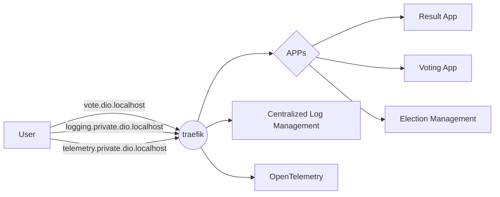

# Hands-On |  LAB Quarkus 2024
 

## Project
Desenvolvendo um sistema para eleção:
* Candidatos são listados, cadastrados e editados
* Todos os candidatos registrados participam de uma eleição, quando for iniciada
* Candidatos recebem votos de eleitores
* Resultado disponível em tempo real

Requisitos não funcionais: 
* confiabilidade
* disponibilidade
* interoperabilidade
* escalabilidade

## Architecture

This architecture has base hwo Orion Architecture

## Environment

* **Java** : JDK 17
	> ✒️ **Obs**. You can use this tools for admin several version of Java in your environment:
	> - [Which JDK](https://whichjdk.com/)
	> - [sdkman](https://sdkman.io)
	
#### conteinerização
* **Docker** : *wy I use docker*
* **Docker Compose** : configuration file multi-container
* **Traefik** : load balanced for conteiner environments
* **Hibernate** : Maping Raltional-Object
* **MariaDB** : (RDBMS)
* **MongoDB** : (NoSQL)
* **Redis** : (NoSQL) Memory System Storage Key-Value 
* **Flyway** : Data Base Migrations
* **Graylog** : Logs Platform Admin
*  **OpenSearch** : Analycs and Search of Data in  Real Time Platform
* **Jeager Tracing** : Plataforma de  Rastreamento

* **Quarkus** : framework
* **Quarkus - Java Native Image** : Criar executaveis nativos a partis de aplicativos java.
* **JUnit** : Testing
* **Testcontainers** : integration test wiht containers Docker pre-cofigurated and scaling to automate tests
